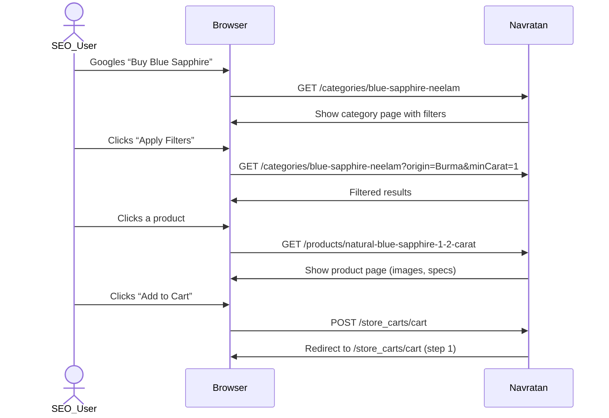

# Executive Summary  
Navratan (navratan.com) is a longstanding Indian gemstone and jewelry retailer (84+ years of history) with a global presence (“50K+ gemstone inventory, shipped to 42+ countries, … 1 lakh happy clients”). Its site serves both wholesale (jewelers/shop owners) and retail (astrology-driven consumers). Key features include category pages for gem types (e.g. “Ruby Stone (Manik Stone)”), themed collections (Navratna, exclusive gems, etc.), jewelry (rings, pendants, earrings), “Astrological Rings”, “Birthstones by Month”, and informational pages (Gem Suggestions, FAQ, blog). Product pages list detailed gem specifications and certificates. Most gemstones are sold either at fixed price or “Contact us for price” (no online price). The site uses standard e‐commerce flows (Search → Category → Product → Cart → Checkout) and also attempts lead-generation via astrologer recommendations (the “Gem Suggestions” page encourages users to submit a form for personalized advice). In this report we map the site’s structure (sitemap), enumerate pages and components, outline the data model, rules, user journeys, SEO observations, trust elements, and finally propose an MVP feature scope and 8–12 week roadmap with Day 1–7 next steps.  

## Objective  
Build a lean e-commerce MVP for Navratan’s gem business (initially supporting B2B shop owners and astrology-focused retail customers) with the future goal of adding an astrologer-driven recommendation engine. The MVP should mirror core Navratan features (product listing, carts, basic checkout, account) and prepare for the “Gem Suggestions” workflow, while streamlining UX.  

## Target Users  
- **Jewelers / Retailers (Shop Owners):** Bulk buyers of certified gemstones. Navratan emphasizes serving “luxury retailers to local jewelers”. These users expect volume pricing, easy catalog navigation (by rashi/zodiac, gemstone), and reliable certificates.  
- **Astrology-Driven Consumers:** Individual buyers guided by Vedic astrology. They search by zodiac sign, birthstone, or planet. Navratan’s content (e.g. Astrological Rings, Birthstones) caters to this segment. They may prefer recommendations from astrologers (see Gem Suggestions page) and could rely on WhatsApp or call inquiries for purchases.  
- **Referral/Inquiry Leads:** Current customers often come via word-of-mouth referrals (testimonial examples) or lead-generation (Gem Suggestion form). The site should capture leads (via “Contact Us” and forms) and facilitate affiliate/astrologer referrals.  

## Sitemap  

**Top-Level Routes:** Navratan’s site is structured with the following primary routes:
- **/** – Home (landing page)  
- **/categories/…** – Category pages for gemstones and collections (e.g. `/categories/ruby-manik-stone`, `/categories/navratna`, `/categories/astrological-rings`, `/categories/gem-suggestions`, `/categories/birthstones-by-month` and each month).  
- **/products/…** – Product detail pages (`/products/<gem-name>-<weight>-carat`, e.g. `/products/natural-ruby-055-carat`).  
- **/pages/…** – Static info pages (e.g. `/pages/contact`, `/pages/ring-size-guide`, `/pages/about-us`, `/pages/faq` etc. as seen in footer navigation).  
- **/customers/login**, **/customers/register** – Account login/registration (customers must login to order or wish-list).  
- **/store_carts/cart** – Shopping cart (and checkout flows).  
- **/store_accounts/…** – (not directly observed but implied for account pages).  

**Category & Product URL Patterns:** Category slugs are human-readable (`/categories/<slug>`), typically `<gemname>-<localname>` or themed (`navratna`, `astrological-rings`, `<month>-birthstone`). Product slugs include gem type and weight (e.g. `natural-ruby-055-carat`).  

**Table: Sitemap Routes and Descriptions**

| **Route**                            | **Description**                                        |
|--------------------------------------|--------------------------------------------------------|
| `/`                                  | Home / Landing page (overview, featured gems)          |
| `/categories/jewellery`              | Jewellery overview (rings, pendants, earrings)         |
| `/categories/rings`, `/categories/pendant`, `/categories/earrings` | Subsections of jewellery (Rings, Pendants, Earrings)   |
| `/categories/astrological-rings`     | Astrological rings info & product listing              |
| `/categories/gem-suggestions`        | “Which gem suits me?” recommendation lead-gen          |
| `/categories/birthstones-by-month`   | Lists links for Jan–Dec birthstones     |
| `/categories/<month>-birthstone`     | Birthstone page for month (e.g. `/march-birthstone`) |
| `/categories/navratna`               | Navratna (9 gems) info page (overview of Navratna) |
| `/categories/<gem>-stone`            | Gemstone category (e.g. `/ruby-manik-stone`) |
| `/categories/specific-collections`   | e.g. `/categories/gubelin-certified-gemstones` (various certified lists) |
| `/products/<product-slug>`           | Product detail page (e.g. `/natural-ruby-055-carat`) |
| `/store_carts/cart`                  | Shopping Cart (step 1/3 of checkout)       |
| `/customers/login`, `/customers/register` | Login & Signup pages      |
| `/pages/contact`                     | Contact Us (address, email, WhatsApp) |
| `/pages/...`                         | Other static pages (About Us, FAQs, Policies etc., as seen in footer) |

```mermaid
graph TD
  Home[Home (/)] 
  Home --> Gemstones[Gemstones Category] 
  Home --> Jewellery[Jewellery Category] 
  Home --> AstroRings[Astrological Rings] 
  Home --> GemSuggest[Gem Suggestions] 
  Home --> Birthstones[Birthstones by Month] 
  Home --> Contact[Contact Us] 
  
  Gemstones --> Navratna[Navratna Gems] 
  Gemstones --> Exclusive[Exclusive Gems] 
  Gemstones --> SapphireSections[Sapphire Varieties] 
  Gemstones --> Upratan[More Vedic Gems] 
  Navratna --> Ruby[Blue Sapphire] 
  Navratna --> Pearl[Yellow Sapphire] 
  Exclusive --> Alexandrite
  SapphireSections --> BiColor
  Upratan --> Amethyst
  AstroRings --> RingType[By Sign / Metal]
  GemSuggest --> AstrologerLead[Astrologer Form]
  Birthstones --> Jan[January Birthstone] 
  Birthstones --> Feb[February Birthstone] 
```

## Full Page Inventory  

- **Home (Landing):** Carousel or banner (no fixed H1). Highlights “Trust, quality, expertise” and key stats (84+ years, 50K+ inventory). Featured categories (gems, rings) with links. Trust cues: Google Reviews (4.8★/226 reviews, testimonial quotes). Footer with company info (Office address), “Our Company” links (About, Blog, FAQs, policies).  
- **Category Templates:** Rich content plus product listing. Examples:  
  - **Gemstone Category:** (e.g. Ruby) Title/H1 (e.g. “Ruby Stone (Manik Stone)”), descriptive text (astrology, properties), then collapsible filters (Price, Origin, Color, Certificate, Shape, Treatment, Cut, Product Type, Weight). Product grid: each item shows name, weight (Carat), SKU, origin, and price or “Contact us for price”. “Add to Cart” button if priced, or “Contact us” if not. Pagination if >1 page (e.g. 1,2,...48). Client testimonials may appear at bottom (on some listings).  
  - **Jewellery Category:** (e.g. /categories/jewellery) H1 “Jewellery”, explanatory text (focus on quality, certification). Sub-navigation to subcategories (Rings, Pendants, Earrings). Each subcategory page lists jewelry items (similarly to gems). Filters on gemstone type, price, etc., where applicable.  
  - **Astrological Rings:** H1 “Astrological Rings”, intro content on astrology and rings. Filters: Type (Men, Women, Unisex) and Metal (Gold, Silver variants). Products (rings) listing similar to gems.  
  - **Gem Suggestions:** H1 “Gem Suggestions”. Descriptive Q&A content about picking gemstones by Vedic astrology. CTAs/link to astrologer form (bit.ly). No product list. Essentially a lead page.  
  - **Birthstones:** Listing page (/categories/birthstones-by-month) with links to 12 months. Each month page (e.g. March) has H1 “March Birthstone (Aquamarine)”, info on that month’s gem (Aquamarine + Bloodstone for March), and list of matching products (likely via a listing or links).  
  - **Contact Us:** Address, email, phone, WhatsApp; “Get in Touch” form (name, email, phone, message).  
  - **Account:** Login page (/customers/login) and Signup page (/customers/register). Users can register (email, password, name, GSTIN) or login. (Wishlist and order history require login).  
  - **Wishlist:** Requires login. (Not directly shown; “Wishlist” nav link opens login.) Post-login, a list of saved products.  
  - **Cart/Checkout:** Cart page (/store_carts/cart) shows “Your Cart” with added items. “Checkout” steps: Address, Payment. (Empty cart page is minimal.)  
  - **Blog/Education:** Linked from footer (“Photo Gallery”, “Gemstone Buying Guide”, “Ring Size Guide”). Example: “Ring Size Guide” page shows instructional content and tables. “Gemstone Buying Guide”, “FAQs”, etc. These use `/pages/...`.  
  - **Footer Links:** Site footer lists Office location (embedded map link), Company info (About, Testimonials, Blog, Careers, etc.), Information (FAQs, Buying Guide, Ring Size), Policies (Shipping, Returns, Privacy, TOS).  

## Component Inventory  

- **Header:** Fixed top with contact number (WhatsApp), currency selector, search box, Account (login/signup), Wishlist, Cart counter. Mega-menu dropdown on “Gemstones” and “Jewellery” with multi-level categories (as seen in [19] navigation).  
- **Mega-Menu:** On desktop, hovering “Gemstones” shows groups (“Navratna”, “Exclusive Gems”, “Sapphire”, “More Vedic Gems”, “Specific Collections”) with links. “Jewellery” shows subcategories (Rings, Pendant, Earrings) with their child links. Mobile likely collapses to accordion (not directly observed).  
- **Filters Sidebar:** On category pages, collapsible/filter panels for refining products by attributes. As listed above: Origin, Color, Certificate, Shape (with icons), Treatment, Cut, Product Type, Weight (Carat/Ratti), Price range (inputs). There are also quick “Sort by” dropdowns (Price low→high, weight etc) in product listings.  
- **Product Card:** In category grid: thumbnail image, product name (including weight e.g. “Natural Ruby – 0.55 Carat”), SKU, origin, price (with currency). If no price, shows “Contact us for price” (no button). “Add to Cart” button present when priced; otherwise an inquiry link (“Contact Us”). Possibly a “Buy Now” button leads directly to checkout. Trust badges (certification logos) may appear on some cards (not clearly seen).  
- **Gallery / Lightbox:** On product page, multiple images with “Prev/Next” carousel and zoom. Thumbnail strip toggles main image.  
- **Certificate Viewer:** Product “Certificate” information (type & number) shown in specs. May link to a PDF certificate (not seen directly). Icons for GIA/IGI/Gubelin appear under images (as clickable filters?).  
- **CTAs and Trust Blocks:**   
  - **CTAs:** “Add to Cart”, “Buy Now” buttons on product pages; category “Apply Filters”; “Submit” on forms.  
  - **Trust Blocks:** Testimonials section on category pages (“Clients Testimonials” with images and quotes); Google Review star rating on product pages (4.8★ from 226 reviews); “Over 4000 happy customers” banner on product page; world-wise shipping info and certifications.  
  - **Cart Enquiry:** If item unpriced, “Contact Us” replaces cart button, routing lead to WhatsApp or email.  

## Data Model  

Key entities and attributes inferred from site data:
```markdown
| **Entity**      | **Attributes (key fields)**                              |
|-----------------|----------------------------------------------------------|
| *Product*       | id, name, slug, description, gemological specs (weight, shape, cut, origin, treatment, color), certificate (type, number), SKU, images[], price, priceState (visible / “contact”), category_id, inventory (stock qty) |
| *Category*      | id, name, slug, parent_id, description                    |
| *Image*         | id, product_id, url, altText                              |
| *Certificate*   | id, product_id, lab_name, certificate_number              |
| *InventoryItem* | id, product_id, stock_qty, location (if multi-warehouses) |
| *PriceState*    | id, product_id, price (or null), isContactForPrice        |
| *User*          | id, email, password_hash, first_name, last_name, mobile, company, GSTIN, addresses[] |
| *Order*         | id, user_id, items[(product_id, qty, price)], status (New, Paid, Shipped), total_amount, currency, shipping_address_id, billing_info, created_at |
| *Cart*          | id (session or user), user_id (opt.), line_items[(product_id, qty)], created_at |
| *Wishlist*      | id, user_id, product_ids[]                                |
| *Recommendation*| id, user_id (if any), birth_chart_data, suggested_gems[], submission_timestamp |
| *Astrologer*    | id, name, expertise, contact_info, commission_rate       |
| *Affiliate*     | id, name, email, referral_code, commission_rate, referred_orders[] |
```
*(Note: Fields are illustrative and may be extended for a real implementation.)*  

## Business Rules  

- **Pricing:** Most gems have a displayed price (with currency); some “high-end” or rare items show no price and display “Contact us for price”. Rule: If `PriceState.contact = true`, user must submit an enquiry rather than add to cart.  
- **Cart vs Inquiry:** “Add to Cart” is enabled only when a numeric price exists. “Buy Now” bypasses cart to checkout directly (for quick purchase). Items with no price require an inquiry: either “Contact Us” button or WhatsApp enquiry.  
- **Certificates:** Only certified stones are sold. Products list “Certificate Type/Number” and often show lab logos. Users trust lab certifications (GRS/Gubelin/etc).  
- **Referral/Commission:** The site has an “Affiliate Register” (not browsed in detail). Likely, affiliates/astrologers get codes or links; orders via those may accrue commission. Commission flow: affiliate shares link → customer buys → system attributes commission to affiliate. (Exact flow not visible, but “Affiliate Register” suggests this support.)  
- **Astrologer Recommendation:** Currently “Gem Suggestions” drives leads via a form. Future rule: After submitting chart data (name, birth details), the system or astrologer recommends gems. These recommendations would map to products. Tracking: a “Recommendation” record links user → suggested products → possibly an order.  
- **User Sessions:** Carts are persisted in session or user accounts. Cart abandonment may trigger reminders (not visible on site).  

## User Journeys  

- **SEO/Shopping Journey:** A user (often via Google search or navigation) lands on a *category page* (e.g. “Buy Blue Sapphire at Best Price”), uses filters (e.g. Origin, Weight) to narrow results, clicks a *product page*, reviews details (images, specs, certificate), then adds to cart or inquires. Finally proceeds to checkout (or WhatsApps if needed).  
- **Astrology Referral → Purchase:** An astrologer or content piece refers a user. The user visits “Gem Suggestions” page, reads FAQs, then submits their birth chart via the embedded form (external link). Based on guidance, the user is presented (or later emailed) recommended gemstone names, clicks those (category/product pages) and completes purchase.  
- **Account/Wishlist:** A user registers (via `/customers/register`) or logs in, then can save products to wishlist (heart icon). Later they login and quickly purchase from wishlist or view order history.  



```mermaid
flowchart LR
    A[Astrologer Referral] --> B[User visits Gem Suggestions page]
    B --> C[User fills astrology form (external)]
    C --> D[Astrologer reviews chart]
    D --> E[Astrologer picks Gemstone(s)]
    E --> F[User clicks recommended Gem product page]
    F --> G[User adds gem to Cart / Enquires]
    G --> H[Checkout / Order placed]
```

## Search & Filters  

The site supports site search and rich faceted filtering:  
- **Search:** A global search bar (header) sends queries to `/products/search` (observed via a pattern in URLs). Search results page lists matching products or categories, and also includes company info (as seen in [19]). Users can search by gem name (e.g. “Coral”) or code. Pagination and sort may apply to search results.  
- **Category Filters:** Each gemstone category has multiple filter facets (checkboxes or ranges) for: Origin, Color, Certificate Lab, Shape (with icons), Treatment (Heated/No Heat), Cut (Faceted/Cabochon), Product Type (Single, Pair, Set), Weight (Carat, Ratti – both as preset ranges and min/max inputs), and Price (min/max inputs). “Apply Filters” button triggers the query.  
- **Astrological Rings Filters:** On `/astrological-rings`, filters are by Type (Men, Women, Unisex) and Metal (White/Yellow/Rose Gold).  
- **Sort:** In product listings (Gem Suggestions page example), a “Sort by” drop-down offers price low→high/high→low, weight, and “New Item First”.  
- **Query Parameters:** While we cannot see exact query strings, filters likely use standard params (e.g. `origin=Burma`, `minPrice=...`, `shape=Oval` etc.), consistent with many e-commerce frameworks.  

## Product Page Specification  

Each product page (e.g. “Certified Natural Ruby – 0.55 Carat”) includes:  
- **Images:** Main image with zoom, plus gallery thumbnails.  
- **Title:** Product name including weight (Carat) and possibly variety (e.g. “Natural Ruby – 0.55 Carat”).  
- **SKU:** Shown next to title (e.g. “SKU: RUB000969”).  
- **Price:** Displayed as “US $1,157.17 (Inclusive of all taxes)” if available. If no price, it says “Contact us for price” (and disables add-to-cart).  
- **Origin:** Gem origin (e.g. Madagascar).  
- **Certification:** Lab & certificate number (e.g. “ICA lab certified”).  
- **Specifications Table:** List of attributes – Weight (Carat and Ratti), Shape, Cut, Composition (Natural/Synthetic), Certificate Type & Number, Treatment, Dimensions, Origin, Color (example above shows all these fields). “Clarity” is shown if relevant (not present for Ruby in example).  
- **Add to Cart / Buy Now:** Quantity selector, “Add To Cart” button and “Buy Now”. (“Buy Now” likely skips directly to checkout.) If out-of-stock or no price, “Notify me” or “Contact us” forms appear.  
- **Trust/Info Links:** Return Policy and Payment Method links.  
- **Social Proof:** Google Review widget (star rating) and customer reviews prompts. Also a line of trust (“Over 4000+ happy customers…”).  
- **Related Products:** A carousel of similar gems.  
- **Q&A/Reviews:** A “Have a question?” enquiry form, and a Reviews section requiring login.  

## Technical Observations  

- **Route Patterns:** Category pages under `/categories/<slug>` and products under `/products/<slug>`. Checkout under `/store_carts` (cart) and likely `/store_carts/address`, `/store_orders/payment`. Static pages under `/pages/`.  
- **Network/API:** The site appears server-rendered (Shopaccino CMS) with no obvious public JSON API. Filters and sorts appear to reload via URL query params rather than XHR.  
- **Mobile Behavior:** HTML uses responsive classes (e.g. ``) suggesting a responsive layout. Mega-menu likely converts to hamburger on narrow view. The presence of large tables (e.g. ring size charts) may scroll horizontally.  
- **Pagination:** Seen on categories with many items. Links “page=2,3…” likely. E.g. Ruby category has 1,2,…48 pages for 1137 items.  
- **Performance/Integrations:** The site loads embedded YouTube/Vimeo iframes (e.g. gem introduction videos). Google Tag Manager is present (loaded as iframe). WhatsApp API link for support is included. No obvious external APIs for product data.  

## SEO Analysis  

- **URL Structure:** Clean, keyword-rich URLs (`/categories/ruby-manik-stone`, `/products/natural-ruby-055-carat`). (Canonical tags likely point to these.)  
- **Titles & H1s:** Category pages use “Buy … at Best Price” titles (inferred from context) and H1 matches (e.g. “Ruby Stone (Manik Stone)”). Product titles (“Certified … – Carat”) match H1s. Meta descriptions likely echo these.  
- **Content:** Category pages include educational/astrological content (good for SEO on long-tail queries). E.g. March birthstone page explicitly mentions “March 2026”. Rich text on “Gem Suggestions” and Astrological Rings likely targets related keywords.  
- **Meta & Canonical:** Likely each canonical points to itself; no duplicate issues seen. Pagination presumably uses `?page=` without duplicate content.  
- **Breadcrumbs:** Shown on product pages (“Home > Ruby > Natural Ruby – 0.55 Carat”) (actually the example shows Home > Ruby > product). These help SEO.  
- **Mobile SEO:** Responsive design and click-to-call (WhatsApp) improves mobile user metrics.  
- **Missing/Improvable:** Blog posts exist (e.g. ring size guide) but site blog seems secondary. Opportunity: create more SEO-focused content (e.g. gemstone guides) and optimize meta tags.  

## Trust Mechanisms  

- **Certifications:** Every gemstone is “certified” (ICA, GIA, IGI, etc.). Product pages prominently show certificate type/number and filter for lab.  
- **Reviews:** Google review badges (226 reviews, 4.8★) and customer testimonials on category pages (e.g. satisfied Yellow Sapphire buyer praising Navratan).  
- **Service Cues:** “Worldwide Shipping in 7 business days” text, detailed “Return Policy” link, secure payment icon (PGI logos in footer), association with known labs (GRS, Gubelin).  
- **Guarantees:** The site claims “100% original” and “customer satisfaction” on the Gem Suggestions page. Company history (84 years) is a soft guarantee of reliability.  
- **Payment Options:** COD (Cash on Delivery) is mentioned on Gem Suggestions page as available, which builds trust for new buyers.  
- **Contactability:** Visible WhatsApp/mobile contacts, and “Notify me” for out-of-stock, enhance user confidence that they can get support.  

## Weaknesses & Opportunities  

- **Pricing Transparency:** Many products require inquiry (“Contact us”) instead of showing price. This can deter some users. MVP could simplify by auto-calculating prices or using dynamic pricing.  
- **Recommendations Engine:** Currently, “Gem Suggestions” links to an external form. Integrating an on-site recommendation quiz (MVP step) would streamline the astrologer workflow and capture leads directly.  
- **User Accounts:** Wishlist and order tracking require login, but signup flow is somewhat lengthy (GSTIN required). Simplify B2B vs retail flows could help conversions.  
- **Mobile UX:** If the site isn’t fully optimized for small screens (not confirmed), ensure the mega-menu and filters work well on mobile. Possibly add a mobile-specific chat/assistant.  
- **Search Functionality:** The current search results page seems sparse (mostly site info). Improving search query handling and result relevance (e.g. fuzzy match on gem names) would aid users.  
- **SEO Gaps:** Some categories (like “Specific Collections”) have very little unique content; adding brief intros could improve long-tail SEO. Also, canonical pagination and faster load times (image compression) are general optimizations.  

## MVP Scope & 8–12 Week Roadmap  

**MVP Features (Phase 1):**  
- Core catalog browsing: categories + filters + products as per Navratan’s structure.  
- Shopping cart and checkout (basic address/payment capture).  
- User accounts (register/login, simple profile, orders).  
- “Contact us” enquiry forms integrated into product pages and a general contact page.  
- Static pages: About, FAQs, Return Policy, etc.  
- Initial Gem Suggestion form (collect chart data and email results, placeholder for astrologer process).  

**Roadmap Milestones:** Create weekly sprints (8–12 weeks total).  

| **Week** | **Goals / Milestones**                                                           |
|----------|----------------------------------------------------------------------------------|
| **1. Planning & Setup**    | Finalize requirements; set up repo and development environment; create basic project skeleton with routing.  |
| **2. Data Model & Backend**| Design database schema for Products, Categories, Users, Orders; implement API endpoints (if decoupled) or pages; seed sample data for a few categories (Ruby, Sapphire, etc.) including images and specs. |
| **3. Category/Listing UI** | Build category listing pages with filtering UI (Origin, Weight, Price). Implement dynamic filters. Seed example Ruby category (with products from Navratan). Integrate pagination. |
| **4. Product UI & Cart**   | Build product detail pages displaying all specs (weight, shape, certificate, etc.) and images. Add “Add to Cart” and “Buy Now” logic. Implement cart page view (list added items). |
| **5. Checkout Flow**       | Build checkout process: Address form, summary, and payment (stub). After “order”, show confirmation. (Integration with payment gateway can be mocked or sandboxed.) |
| **6. User Accounts**       | Develop user registration/login. Upon login, allow viewing order history and saving wishlist (as separate DB tables). Ensure checkout optionally requires login or guest options. |
| **7. Static & Informational Pages** | Implement static pages: Home (with intro content), About Us, Contact Us (with form), Policies, FAQs. Create “Gem Suggestion” page with astrological content (as Navratan does). |
| **8. Search & SEO**        | Add site search (simple text search across product names). Optimize URLs, meta tags, and H1 for SEO (e.g. “Buy [Gem] at Best Price”). Test mobile responsiveness and performance. |
| **9. Astrologer Engine Prototype** | Add a basic recommendation form on “Gem Suggestions” (collect birth details). Implement admin view where astrologer can assign recommended products. (Or integrate a rules-based suggestion based on zodiac as a placeholder.) |
| **10. Testing & QA**       | End-to-end testing of shopping flow, filters, mobile UI. Get feedback from stakeholders. Fix bugs and refine UX (e.g. form validations). |
| **11. Deployment & Analytics** | Prepare production deployment; integrate analytics (e.g. Google Analytics, conversion tracking). Ensure SSL, SEO-friendly sitemap. |
| **12. Buffer & Launch**    | Time for polish, performance tuning, and unexpected issues; plan launch strategy. |

## Day 1–7 Recommended Actions  

1. **Gather Requirements & Stakeholder Meeting:** Review Navratan’s current site, inventory, and business rules in detail. Confirm priorities (e.g. focus on wholesale vs retail, payment methods, etc.).  
2. **Wireframes & Sitemap:** Create initial wireframes for home, category, product, cart, and gem-suggestion pages to align on structure. Finalize the full list of routes (using table above).  
3. **Tech Stack Setup:** Choose frameworks (e.g. React/Vue + Node or Django?), install libraries, configure version control and CI/CD basics.  
4. **Database Design:** Sketch out the data model entities (product, category, user, order, recommendation, affiliate). Prepare database migrations/schema.  
5. **Prototype Category Page:** Build a minimal category page with static filters (to validate UI/UX) using sample product data. Ensure navigation works as expected (links, breadcrumbs).  
6. **User Stories / Backlog:** Write detailed user stories (e.g. “As a user, I can filter Blue Sapphire by origin Burma” or “As an astrologer, I want to assign a gem to a customer request”). Rank features.  
7. **Risk Assessment:** Identify integration points (e.g. payment gateway, certification verification) and plan mitigations. Ensure compliance (e.g. GST handling for B2B).  

This detailed analysis, inventory, and roadmap should guide the development of a focused Navratan-like gemstone e-commerce MVP, ensuring all critical aspects (site structure, user flows, business logic, and technical considerations) are covered from Day 1 onward.  

**Sources:** Data and insights drawn from the live Navratan site pages and the provided inventory PDF. All site content and quotations are cited from primary pages as indicated.